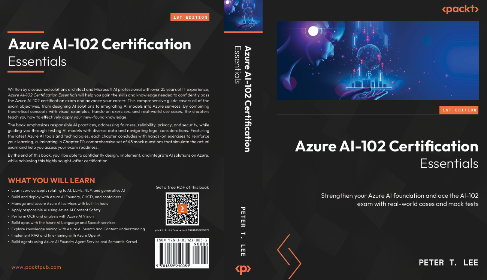

<p align='center'><a href='https://www.eventbrite.com/e/algorithmic-trading-with-python-cohort-2-tickets-1833367644979?aff=oddtdtcreator'></a></p>


# 🤖 Azure AI-102 Certification Essentials

[](https://ai.azure.com/)
[](https://ai.azure.com/)
[](https://python.org/)
[](https://jupyter.org/)
[](https://github.com/dhangerkapil/ai-foundry-e2e-lab)

> A comprehensive guide to mastering Azure AI services and passing the AI-102 certification exam
> 
[](https://www.amazon.com/Azure-AI-102-Certification-Essentials-full-length/dp/1836205279/ref=sr_1_1?crid=32KGWK2BJCBJX&dib=eyJ2IjoiMSJ9.HZlmxknfL4Fl8lW34s_PDCUG2lORDNIsXcjuebd9tI9vB1u2ftDAMICSsZhEZM-Y6pt5fyY1BeEt-4Jp3ilT3w.LKeGRJOUSfVdYH_rJJypXfxJxGgx2eR-I1JylwndfW4&dib_tag=se&keywords=azure+ai-102+certification+essentials&qid=1753571567&sprefix=ai-102+e%2Caps%2C100&sr=8-1)


## 📖 Table of Contents
- 🤖 Azure AI-102 Certification Essentials
	- [📝 Preface](#-preface)
	- [👥 Who this book is for](#-who-this-book-is-for)
	- [📚 What this book covers](#-what-this-book-covers)
	- [📖 Citation](#-citation)

---

## 📝 Preface 
The timing for Artificial Intelligence (AI) could not be better. As an AI/data solution architect at 
Microsoft, I have witnessed firsthand the transformative power of AI, especially since the advent of 
OpenAI. The world is evolving rapidly, and traditional processes are being reimagined.

Take, for example, one of my insurance clients. They used to deal with vast amounts of unstructured 
data, such as PDFs and emails. Teams of hundreds of people manually extracted information from 
thousands of files, entered it into the custom structured format of Excel, validated the data, and 
passed it to business analysts to generate reports. Decision-makers would then rely on these reports 
to make critical choices.

Now, with AI, this entire workflow is automated. AI extracts data from structured, semi-structured, 
and unstructured sources, stores it in a database, and generates analytic reports. It even enables users 
to interact with their data conversationally. The result? Millions of dollars saved and a significant 
boost in productivity.

If you’re excited to be part of this transformative journey, you’ve come to the right place. This book 
not only focuses on helping you pass the AI-102: Azure AI Engineer Associate Certification but also 
equips you with real-world project experience (Chapter 10). My goal is for you to walk away with both 
the confidence of a certified professional and practical skills that open doors to new opportunities.

Whether you’re considering a career switch to AI or enhancing your current skill set, I welcome you 
to this exciting moment. Let this book be your gateway to a rewarding and dynamic future. I hope 
you enjoy the journey! 🚀

---

## 👥 Who this book is for 
This book is designed for anyone preparing for the AI-102: Azure AI Engineer Associate Certification 
exam, regardless of their background. It’s an excellent resource for developers and engineers looking 
to expand their knowledge of AI within the Azure ecosystem. For those transitioning from traditional 
software development roles to AI-focused careers, this book provides the tools and insights needed to 
thrive in AI projects using Azure. Students and educators will also find it valuable, offering practical 
ways to connect AI concepts with real-world applications.

While some familiarity with AI/ML concepts or development practices can be helpful, it’s not a 
requirement. The book includes a clear, comprehensive summary of the exam topics and provides 
additional resources to support your learning journey. Through practical examples, hands-on exercises, 
and straightforward explanations, this book aims to give you the confidence to pass the Azure AI-102 
exam and apply your skills to real-world AI projects.

---

## 📚 What this book covers 
This book is structured to closely follow the official Microsoft study guide for Exam AI-102, ensuring 
comprehensive coverage of the certification objectives. You may notice that some of the latest Azure 
AI services or features are either not included or only briefly mentioned. That’s intentional—I focused 
on what’s required for the exam rather than trying to chase every new release. However, as long as you 
understand the foundational concepts—the principles that power both current and future services—
 you’ll be well-prepared to adapt to whatever comes next. Think of this book as a cornerstone for your 
AI career. That’s also why I included Chapter 10, which goes beyond the exam content to showcase 
real-world use cases and project examples. These are designed to not only reinforce your knowledge 
but also help you transition from passing the exam to confidently applying AI in practical scenarios. 

This book will help you earn your certification—but more importantly, it will prepare you to think 
and operate like a real AI professional from day one.
Let’s look at what is covered in each chapter.

Chapter 1, Understanding AI, ML, and Azure’s AI Services, introduces key AI and ML basic concepts, 
including advanced topics such as deep learning and generative AI, foundational elements such as 
Large Language Models (LLMs), Natural Language Processing (NLP), and prompt engineering, 
and an overview of Azure’s AI services, equipping you with a foundational understanding to build 
on in later chapters.

**Chapter 2: Getting Started with Azure AI** ⚙️  
Introduces key Azure development environments (Azure AI Foundry, Azure OpenAI, Machine Learning Studio, and Copilot Studio) along with Visual Studio Code (VS Code), explores their roles in AI development, and covers CI/CD integration, resource management, and container deployment strategies for flexible and secure AI model hosting.

**Chapter 3: Managing, Monitoring, and Securing Azure AI Services** 🔒  
Focuses on managing and monitoring 
Azure AI services by covering diagnostic logging, performance metrics, cost management, secure key 
handling, network security, authentication mechanisms, and private communications, providing the 
tools to ensure smooth and secure AI deployments.

**Chapter 4: Implementing Content Moderation Solutions** 🛡️  
Emphasizes the importance of responsible AI 
principles (fairness, transparency, accountability, and more) in developing ethical AI systems, addresses 
the unique risks of generative AI, and explores mitigation strategies such as Azure AI Content Safety 
and the Responsible Innovation framework to ensure secure and reliable AI deployment.


**Chapter 5: Exploring Azure AI Vision Solutions** 👁️  
Explores Azure AI Vision’s capabilities for image and 
video analysis, including object detection, face recognition, Optical Character Recognition (OCR), 
custom model development, and video insights such as scene detection and real-time spatial analysis, 
equipping you to extract meaningful data from visual content.

**Chapter 6: Implementing Natural Language Processing Solutions** 💬  
Covers advanced text and speech 
analysis using Azure AI Language and Speech services, including NLP techniques, speech-to-text, 
text-to-speech, custom speech solutions, and translation capabilities, enabling the development of 
intelligent, multilingual, voice-enabled applications.

**Chapter 7: Implementing Knowledge Mining, Document Intelligence, and Content Understanding** 📄  
Teaches 
you how to use Azure AI Search and Document Intelligence tools to extract, organize, and analyze 
unstructured data, transforming it into actionable insights and automating data processing workflows.

**Chapter 8: Working on Generative AI Solutions** 🎨  
Explores the practical use of generative AI with Azure 
OpenAI Service, covering text, code, and image generation, model deployment, API usage, fine
tuning, and integrating data with Retrieval-Augmented Generation (RAG) to create customized 
AI-driven solutions.

**Chapter 9: Implementing Agentic Solutions with Azure AI Agent Service** 🤖  
Explores how to design, build, 
and deploy intelligent AI agents using Azure tools and frameworks such as Azure AI Agent Service, 
Semantic Kernel, and AutoGen. It explores core agent components and real-world use cases and 
compares development approaches through hands-on exercises. The chapter also covers collaborative 
agent orchestration, deployment best practices, and strategies for monitoring and securing agents 
in production.

**Chapter 10: Practical AI Implementation** 🛠️  
Explores AI’s transformative impact through technical patterns such as custom Copilot, chat with your 
own data, and document processing, real-world applications in various industries, RAG patterns, and 
advanced tools for data extraction and AI search, supported by hands-on projects.

**Chapter 11: Preparing for the AI-102 Certification Exam** 📝  
Prepares you for 
the AI-102 certification by outlining the exam framework, key focus areas, and preparation strategies, 
and providing a comprehensive practice exam to assess your readiness.

The following diagram outlines the recommended flow for navigating this book. Chapter 1 provides 
an overview of all the key concepts covered throughout the chapters, serving as a foundation. You 
can always revisit relevant concepts while working through Chapters 3 to 9. One suggested approach 
is to focus on an AI service that interests you most, read through the relevant section, and then dive 
into the corresponding chapter instead of going through all the details in Chapter 1 upfront. Chapter 2 
comes next, as it covers the essential service setup and provides information such as service endpoints 
and keys needed for exercises in later chapters.

The chapters are ordered based on current hot topics and typical excitement, with Chapter 8 focusing 
on generative AI and OpenAI. However, you are encouraged to start with any service or topic that 
interests you most, ensuring you stay motivated and make steady progress through the book. Chapter 11 
is dedicated to exam practice and detailed explanations. It’s strongly recommended that you review 
all the questions—both the correct and incorrect answers—along with the reference links provided 
to deepen your understanding of each topic. Some exam questions may cover areas not discussed in 
detail earlier in the book due to space limitations. This chapter offers a valuable opportunity to fill in 
those gaps and strengthen your preparation for the certification exam.

Chapter 10, while not mandatory for the certification exam, is highly recommended. It offers hands-on activities with real-world projects that will solidify your expertise. Following this flow will guide you effectively through the book. Best of luck on your journey! 🚀


---

## 📖 Citation
GitHub repository for [Azure AI-102 Certification Essentials book](https://www.amazon.com/Azure-AI-102-Certification-Essentials-full-length/dp/1836205279/ref=sr_1_1?crid=32KGWK2BJCBJX&dib=eyJ2IjoiMSJ9.HZlmxknfL4Fl8lW34s_PDCUG2lORDNIsXcjuebd9tI9vB1u2ftDAMICSsZhEZM-Y6pt5fyY1BeEt-4Jp3ilT3w.LKeGRJOUSfVdYH_rJJypXfxJxGgx2eR-I1JylwndfW4&dib_tag=se&keywords=azure+ai-102+certification+essentials&qid=1753571567&sprefix=ai-102+e%2Caps%2C100&sr=8-1)

```bibtex
@book{ai102-certification-essential2025, 
	title = {Azure AI-102 Certification Essentials}, 
	author = {Peter T. Lee}, 
	year = {August,2025}, 
	isbn = {978-1836205272}, 
	print = {packt} 
}
```
